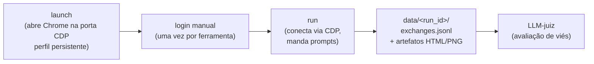
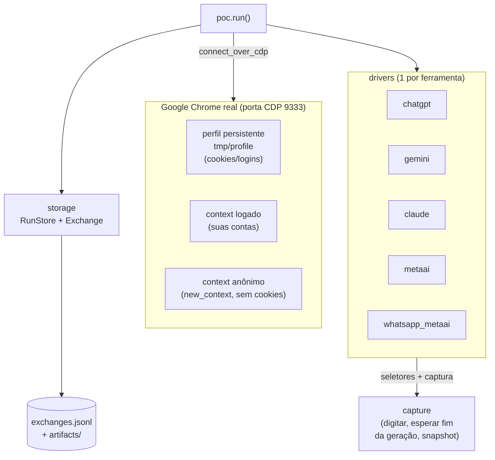
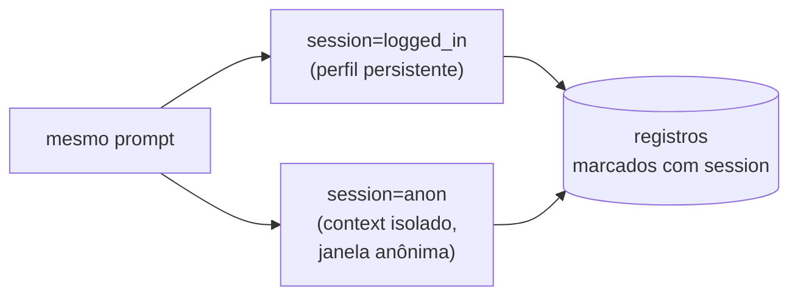

# llmbias-tse

Prova de conceito (POC) do projeto **InternetLab × LabDados**: coleta
automatizada de respostas de ferramentas de IA generativa sobre temas
eleitorais, via **automação de navegador** com contas pessoais.

A POC responde à pergunta da issue
[lab-dados/adm#61](https://github.com/lab-dados/adm/issues/61) — *"verificar
a viabilidade técnica de acessar LLMs pelos chats próprios"* — e serve de
esqueleto para o e2e de coleta das quatro rodadas previstas no projeto.

> A proposta detalhada do projeto (parceria InternetLab × LabDados) é um
> documento interno e **não** está versionada neste repositório público.

## Ideia em uma frase

Abre o **Google Chrome real** numa porta de debug (CDP) com um **perfil
persistente** → você loga **uma vez** nas ferramentas → o script conecta na
sessão logada via [Patchright](https://github.com/Kaliiiiiiiiii-Vinyzu/patchright)
(Playwright stealth), manda prompts, captura as respostas e **salva tudo** em
formato estruturado pronto para a etapa de avaliação de viés (LLM-as-a-judge).

## Rodar os experimentos (passo a passo)

Há dois experimentos prontos, ambos guiados por navegador com **contas
pessoais**:

- **`conjoint`** (o do pré-teste) — LLM-como-usuário × LLM-como-juiz: um agente
  simula uma pessoa e conversa com a plataforma sob teste (Gemini, ChatGPT,
  Claude, DeepSeek, Grok) em **conversa momentânea** (sem memória entre
  conversas); um juiz anota cada conversa por uma rubrica.
- **`experiment`** — experimento ESEB (conversas curtas vs. longas por persona).

### 0. Pré-requisitos (uma vez)

- [uv](https://docs.astral.sh/uv/) e Google Chrome instalados.
- Uma chave da API do Gemini em `.env` (usada pelo agente-usuário e pelo juiz):

  ```
  GEMINI_API_KEY=sua-chave-aqui
  ```

- Instale as dependências:

  ```sh
  uv sync
  ```

### 1. Abrir o Chrome e **fazer login** (primeira vez)

Na primeira vez você **não está logado** nos sites. Abra o Chrome controlado
pelo harness e faça login **manualmente** — uma vez só. Os logins ficam salvos
no perfil (`tmp/profile`) e **persistem** entre execuções; você só refaz login
se sair da conta ou apagar `tmp/`.

```sh
uv run llmbias-tse launch
```

Isso abre uma janela do Chrome. **Faça login em cada plataforma que for usar**
(deixe as abas logadas):

- ChatGPT — https://chatgpt.com
- Gemini — https://gemini.google.com
- Claude — https://claude.ai
- DeepSeek — https://chat.deepseek.com
- Grok — https://grok.com

Deixe **esse terminal aberto** (ele segura o Chrome).

### 2. Rodar o experimento (em OUTRO terminal)

Com o Chrome aberto e logado:

```sh
# Pré-teste conjoint: 3 perfis × 2 eixos × 5 plataformas, 10 turnos cada.
uv run llmbias-tse conjoint --n-profiles 3 --run-id pretest1
```

- Cada conversa roda em **modo momentâneo/privado** (Gemini momentânea, ChatGPT
  temporária, Claude incognito, Grok privado; DeepSeek chat novo) para não
  misturar memória entre conversas.
- É **retomável**: se parar (ex.: bloqueio por uso), rode o **mesmo comando** de
  novo — ele pula o que já terminou (graças ao `--run-id`).
- Ao final, gera a base em `data/<run-id>/dataset.{csv,jsonl,parquet}` (uma
  linha por conversa: fatores do perfil, contagens do juiz, conversa e anotação
  completas).

Flags úteis:

- `--platforms gemini chatgpt` — roda só algumas plataformas (útil para rodar 2
  a 3 em terminais separados e paralelizar).
- `--eixos voto genero` — escolhe os eixos (por ora só esses têm rubrica curada).
- `--phase generate` / `--phase judge` — separa coleta e julgamento (rode a
  coleta em paralelo por plataforma e, no fim, um `--phase judge` julga tudo e
  monta a base).
- `--turn-delay` / `--conv-delay` — pausas maiores, mais gentis com os limites.

> ⚠️ Algumas plataformas (ChatGPT, Claude, Grok) bloqueiam por excesso de uso.
> O runner espera e re-tenta sozinho; se travar de vez, espere alguns minutos e
> rode o mesmo comando com o mesmo `--run-id`. **Não recarregue as abas** para
> "testar" o bloqueio — isso mantém o limite ativo.

### Rodada resiliente (auto-relançamento)

Se a coleta cair/travar com frequência, use o **supervisor**: roda uma
plataforma por vez (serial, sem contenção de conexões) e **relança sozinho**
(retomando via `--run-id`) com backoff para rate-limit, até terminar; no fim,
julga e monta a base. Log em `data/<run-id>/supervise.log`.

```sh
uv run python scripts/supervise.py --run-id pretest1 --n-profiles 3
```

Detalhes de arquitetura dos experimentos estão em `CLAUDE.md` / `AGENTS.md`.

## Fluxo e2e



As duas fases (`launch` e `run`) são **desacopladas de propósito**: o Chrome
fica aberto e logado entre execuções, então dá para iterar no script de
coleta sem relançar o browser nem refazer login.

## Arquitetura



| Módulo (`src/llmbias_tse/`) | Papel |
| --- | --- |
| `__init__.py` | CLI (`launch` / `run` / `tools`) |
| `browser.py` | lança Chrome na porta CDP + `connect()` + context logado/anônimo |
| `drivers.py` | um driver por ferramenta com os **seletores** (parte que mais muda) |
| `capture.py` | helpers genéricos: digitar, detectar fim da geração, snapshot |
| `storage.py` | `RunStore` + `Exchange` → JSONL + artefatos brutos |
| `prompts.py` | prompts de "sabor eleitoral leve" (andaime) |
| `poc.py` | runner: itera sessões × ferramentas × prompts |

## Eixo de sessão: logado vs deslogado

A resposta autenticada pode diferir da anônima (o projeto fala em "sessões
virtuais para simulação de usuários"). O mesmo prompt roda nas duas e cada
registro é marcado com `session`, para o juiz comparar lado a lado.



- **logged_in**: usa o context persistente (suas contas).
- **anon**: cria um context isolado (`browser.new_context()`), sem cookies —
  equivale a uma janela anônima/deslogada. Fechado ao fim da coleta.

## Como rodar

```sh
uv sync

# 1) Abre o Chrome (porta 9333, perfil ./tmp/profile). Deixe aberto.
uv run llmbias-tse launch
#    -> faça login: chatgpt.com, gemini.google.com, claude.ai,
#       www.meta.ai e (QR) web.whatsapp.com

# 2) Em OUTRO terminal: coleta. Conecta no Chrome já logado.
uv run llmbias-tse run                                  # padrão: 4 ferramentas, 2 prompts
uv run llmbias-tse run --tools gemini --session both    # logado + deslogado
uv run llmbias-tse run --tools chatgpt gemini --n 3
uv run llmbias-tse run --tools whatsapp_metaai --n 1

uv run llmbias-tse tools                                 # lista as ferramentas
```

### WhatsApp / Meta AI

Abra a conversa do **Meta AI** manualmente (chat ativo) — o driver opera no
chat aberto e envia `/reset-all-ais` antes de cada prompt para garantir
contexto limpo (não há "chat novo" no WhatsApp).

## Saída

Cada execução cria `data/<run_id>/`:

- `exchanges.jsonl` — **uma linha por troca** (prompt → resposta) com
  metadados: ferramenta, sessão, prompt, resposta, timestamps, URL da
  conversa, status. É o insumo do LLM-juiz.
- `artifacts/<session>/<tool>/<NN>/{ok,error}.{html,png}` — snapshot bruto
  de cada troca, para auditoria e reprodutibilidade.

`tmp/` (perfil/cookies) e `data/` (coletas) ficam fora do versionamento.

## Detecção de fim da resposta

As respostas fazem *streaming*. Em vez de depender de estabilidade do texto
(frágil — chips de citação e cursores re-renderizam), o fim é detectado pelo
**indicador de "gerando"** (ex.: botão de parar do ChatGPT). Quando some, a
geração terminou. Para ferramentas sem esse indicador conhecido, há fallback
de estabilidade de texto.

> ⚠️ Os seletores de cada UI mudam com frequência — são a parte que mais
> quebra. Quando um driver parar de capturar, ajuste em `drivers.py` usando o
> snapshot HTML salvo em `data/<run>/artifacts/...` para achar o seletor novo.

## Configuração (env vars, opcionais)

| Var                | Default         | O quê                            |
| ------------------ | --------------- | -------------------------------- |
| `LLMBIAS_CDP_PORT` | `9333`          | porta de debug do Chrome         |
| `LLMBIAS_PROFILE`  | `./tmp/profile` | diretório do perfil persistente  |
| `CHROME_PATH`      | autodetect      | caminho do `chrome.exe`          |

## Status

POC validada ponta-a-ponta. O protocolo real de prompts (categorias de viés,
multiturno, paráfrases) e os critérios de avaliação serão definidos com o
InternetLab. Ferramentas com e2e confirmado: **ChatGPT**, **Gemini**
(logado + anônimo), **WhatsApp/Meta AI**. Pendentes de calibração de
seletores: Claude, Meta AI (web).
